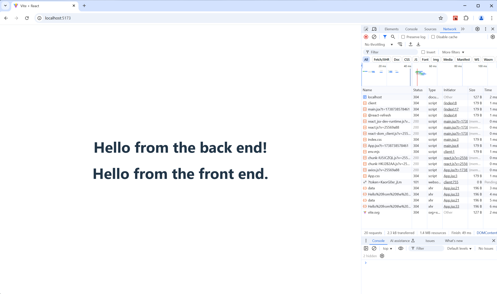

# Task Name

## Description
The task outlines how to intergate a backend API using express with a frontend client side using vite/react

## Table of Contents
- [Installation](#installation)
- [Usage](#usage)
- [Credits](#credits)

## Installation

```bash
# Clone the repository
git clone https://github.com/Russell-Fulwood/codingTasks.git

# Navigate to the project directory
cd codingTasks/FEBE-Intergation-Practical-Task

# backend
cd backend

# Install dependencies
npm install

# frontend
cd ../frontend

# Install dependencies
npm install
```

## Usage

```bash
# Run the backend from the backend directory
npm start

# next run the frontend from the frontend directory
npm run dev

access the the returned url in a web browser


```

## Credits

* Russell Fulwood
